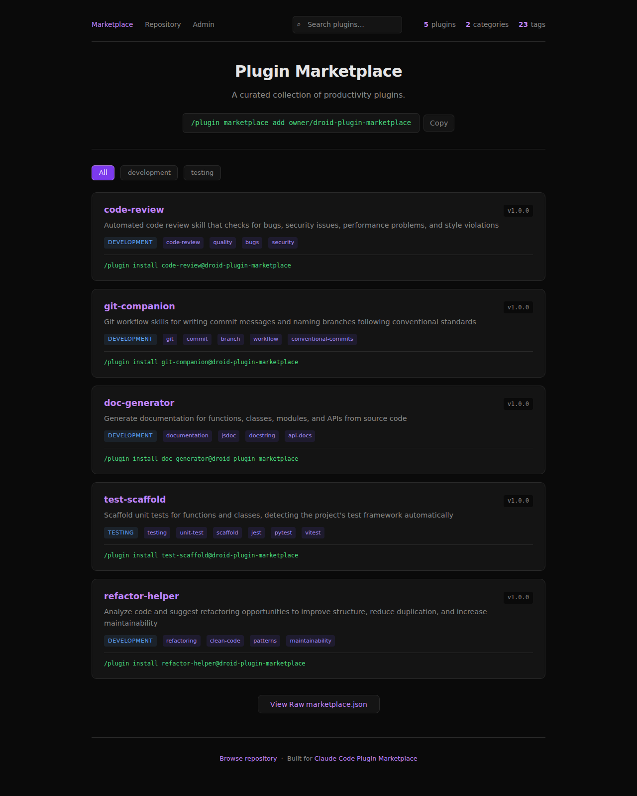
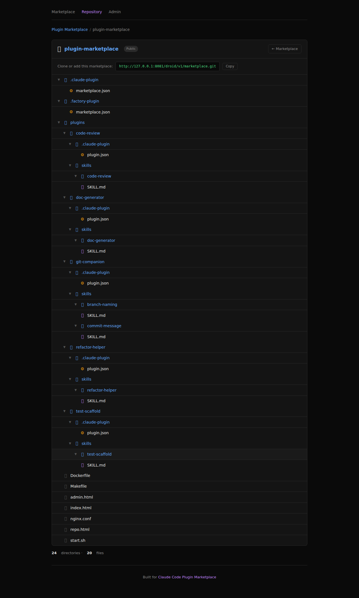
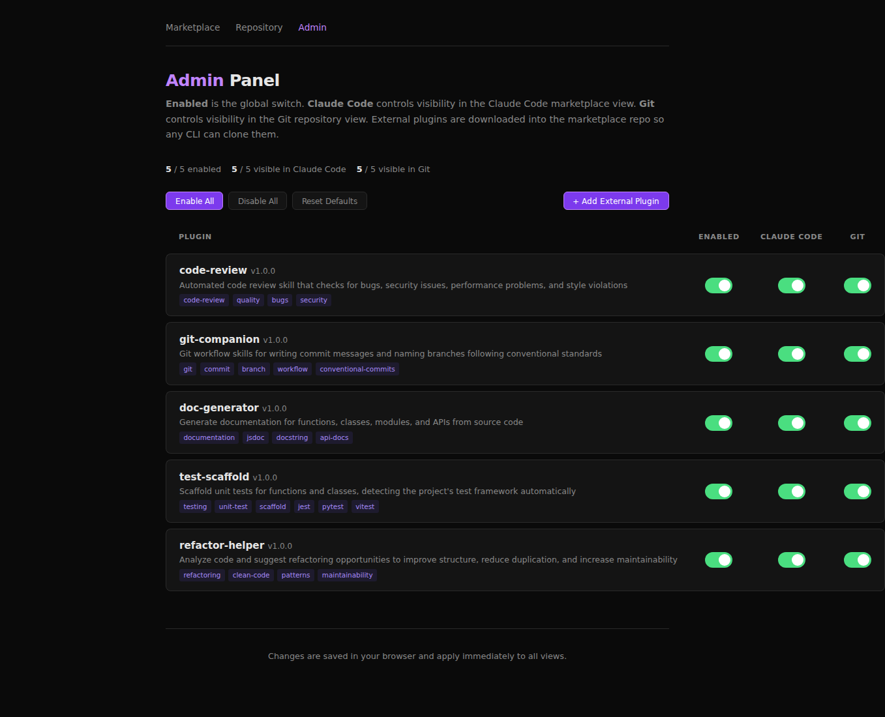

# Droid Plugin Marketplace

A self-hostable plugin marketplace that serves the **same catalog** to both
**Claude Code** (via static `marketplace.json`) and **Droid CLI** (via a Smart-HTTP
git endpoint) from a single nginx + git-http-backend container.

| What you get | How it's served |
|---|---|
| 5 productivity plugins (code-review, git-companion, doc-generator, test-scaffold, refactor-helper) | `plugins/<name>/.claude-plugin/plugin.json` + `SKILL.md` files |
| Claude Code marketplace | `GET /.claude-plugin/marketplace.json` (static) |
| Droid CLI marketplace | `git clone http://<host>/droid/v1/marketplace.git` (Smart-HTTP) |
| Browser UI | `/index.html`, `/repo.html`, `/admin.html` |

## Screenshots

| Marketplace (`/index.html`) | Repository (`/repo.html`) | Admin (`/admin.html`) |
|---|---|---|
|  |  |  |
| Plugin grid with search, category filter, and live stats. Same data the Claude Code CLI sees via `/.claude-plugin/marketplace.json`. | Browseable file tree of the served bare repo. Click any file to open the in-page viewer (markdown-rendered, JSON pretty-print toggle, plain text). | Per-plugin toggles for Enabled / Claude Code / Git visibility. Add an external GitHub plugin from the modal — its files are downloaded into the marketplace repo. |

## Quickstart (3 minutes)

**Prereqs:** Docker, `make`, `git`, `curl`.

```bash
git clone https://github.com/leonj1/plugin-marketplace.git
cd plugin-marketplace
make build      # ~30s first time, cached after
make start      # serves on http://localhost:8081
make test       # end-to-end test: HTTP + Smart-HTTP + git clone
```

Expected `make test` output ends with:

```
All checks passed — any CLI can clone http://localhost:8081/droid/v1/marketplace.git
```

Useful targets:

| Target | What it does |
|---|---|
| `make build` | Build the Docker image |
| `make start` | Run the container on port 8081 |
| `make stop` | Stop and remove the container |
| `make restart` | `stop` + `start` |
| `make status` | Is the server running? |
| `make test` | Run `test-clone.sh` against the running container |

Override the port: edit `PORT` at the top of `Makefile:1`.

## How it works

```
                                  +-----------------------------+
   GET /.claude-plugin/...        |                             |
   GET /.factory-plugin/...  ---> |        nginx (static)       |
                                  |                             |
   git clone /droid/v1/...        |                             |
            |                     |       location ~ ^/droid    |
            v                     |               |             |
   info/refs, git-upload-pack --> |        fastcgi_pass         |
                                  |               |             |
                                  |  fcgiwrap -> git-http-backend
                                  |               |             |
                                  |        /var/lib/git/        |
                                  |   droid/v1/marketplace.git  |
                                  +-----------------------------+
```

On first start, `start.sh:1-43` initializes a bare git repo at
`/var/lib/git/droid/v1/marketplace.git`, commits the marketplace contents into
it, and runs `git update-server-info`. Nginx (`nginx.conf:23-30`) routes
`/droid/v1/marketplace.git/...` to `git-http-backend` via FastCGI; everything
else is served as static files.

## Configure your CLI to use this marketplace

Replace `http://localhost:8081` with your deployed host (and port).

### Claude Code

Claude Code reads the marketplace from a `.claude-plugin/marketplace.json` URL.
Add an entry to your Claude Code settings (or use the in-app marketplace
dialog) pointing at:

```
http://localhost:8081/.claude-plugin/marketplace.json
```

In `~/.claude/settings.json` (path may vary by platform):

```json
{
  "marketplaces": [
    {
      "name": "droid-plugin-marketplace",
      "url": "http://localhost:8081/.claude-plugin/marketplace.json"
    }
  ]
}
```

After Claude Code reloads, the five plugins appear in the marketplace UI and
can be installed individually.

### Droid CLI (Factory)

Droid CLI consumes the marketplace by **cloning a git repository** that
contains a `.factory-plugin/marketplace.json` at its root. Point Droid at the
Smart-HTTP URL exposed by this container:

```
http://localhost:8081/droid/v1/marketplace.git
```

Verify it works without Droid first:

```bash
git clone http://localhost:8081/droid/v1/marketplace.git
ls marketplace/.factory-plugin/marketplace.json
```

Then add the marketplace to Droid (`~/.factory/config.json` or via
`droid marketplace add`, depending on your version):

```json
{
  "marketplaces": [
    {
      "name": "droid-plugin-marketplace",
      "git": "http://localhost:8081/droid/v1/marketplace.git"
    }
  ]
}
```

Droid will `git clone` (and later `git pull`) this URL, parse
`.factory-plugin/marketplace.json`, and surface the plugins listed there.

### Same catalog, two formats

Both `.claude-plugin/marketplace.json` and `.factory-plugin/marketplace.json`
in this repo describe the **same five plugins** with identical `source`
paths under `plugins/`, so installing from either CLI gets you the same
skills.
